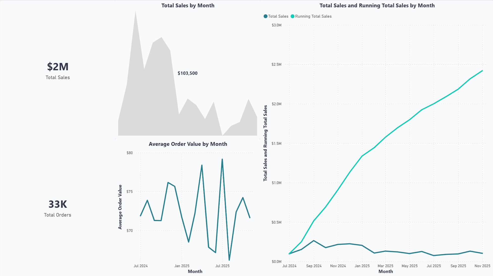
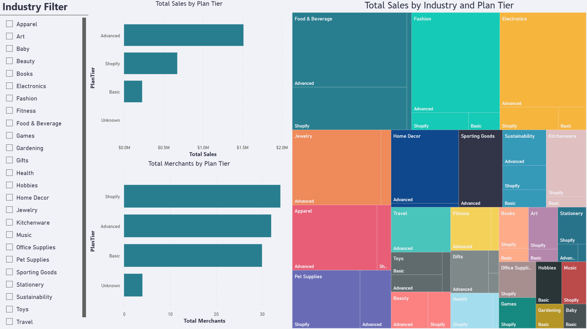
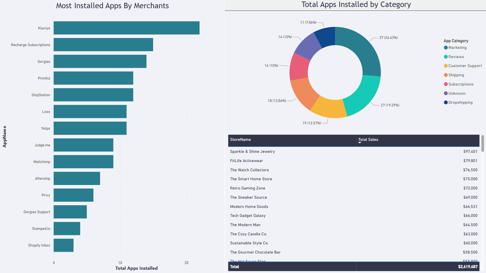
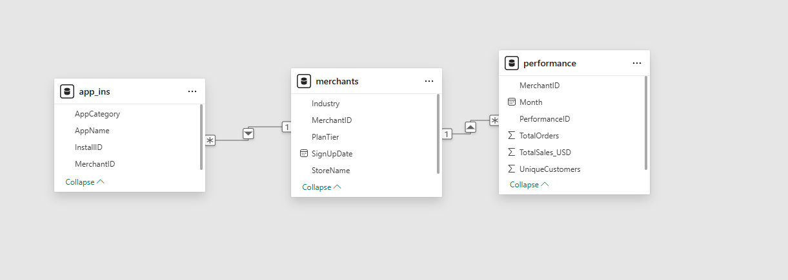

# Shopify Merchant Success Analysis

## Business Objective

The primary objective of this project was to develop an end-to-end business intelligence solution to analyze Shopify merchant data. The goal was to identify the key factors and behaviors that differentiate high-performing merchants from low-performing ones. The insights from this dashboard are intended for a fictional "Merchant Education" team to help them create targeted content and guides to foster merchant success.

## Dashboard Demo

### Page 1: Executive Overview
This page provides a high-level, at-a-glance summary of the marketplace's health, focusing on key performance indicators and overall growth trends.

**

### Page 2: Plan & Industry Deep Dive
This page allows for a more granular analysis, enabling users to explore performance across different plan tiers and merchant industries to identify the most profitable segments.

**

### Page 3: App Analysis
This page focuses on the Shopify App ecosystem, revealing which apps are most popular and how app adoption correlates with merchant success.

**

---

## Technical Skills & Tools Used

-   **Power BI:** Used for data modeling, DAX calculations, and dashboard design.
-   **Power Query:** Used for all data cleaning and transformation (ETL) processes.
-   **DAX (Data Analysis Expressions):** Used to create custom measures and KPIs.

## Data Cleaning & Transformation (ETL)

The initial dataset was synthetically generated to model a real-world business scenario, complete with intentional flaws to showcase data cleaning and preparation skills. The following steps were performed in Power Query:

-   **Standardized Text Data:** Corrected typos, inconsistent casing (`Basic` vs. `basic`), and extra spacing to ensure data consistency.
-   **Handled Null/Empty Values:** Replaced all null values in categorical columns (`PlanTier`, `Industry`, `AppCategory`) with "Unknown" to ensure all records could be included in the analysis.
-   **Removed "Lost" Records:** Performed an inner join between the `apps_final` and `merchants_final` tables to filter out app installation data for merchants who did not exist in the master list, ensuring data integrity.

## Data Modeling

A **star schema** was implemented to create a robust and efficient data model.

-   The `merchants_final` table serves as the central **dimension table**.
-   The `performance_final` and `apps_final` tables serve as **fact tables**.
-   Relationships were established between the tables based on the `MerchantID` key, using **one-to-many cardinality**. This model allows for seamless filtering and cross-analysis between all three tables.

**

## DAX Measures

Several key DAX measures were created to power the dashboard's analytics, including:

-   **`Total Sales`**: The sum of all sales across all merchants.
-   **`Total Merchants`**: A distinct count of all unique merchants.
-   **`Average Order Value (AOV)`**: A ratio of `Total Sales` to `Total Orders` to measure transaction quality.
-   **`Running Total Sales`**: A cumulative sum of sales over time to visualize overall growth.

## Key Insights & Analysis

### From the Executive Overview:
-   While monthly sales exhibit natural fluctuations, the **cumulative (running total) sales show a strong and consistent upward growth trajectory**, indicating the overall health of the marketplace.
-   The **Average Order Value (AOV) trend remains stable** over time. This visual was intentionally made static to serve as a reliable baseline for comparison when filtering by other visuals on the page.

### Correlation Between Top Industries and Premium Plans:
-   The **'Advanced' plan tier is the primary revenue driver**. However, it is only the second most populated plan tier, slightly behind *Shopify* and not significantly larger than *basic*.
- The treemap visual confirms that top earning Industries like fashion, food and beverage, and electronics are the largest contributors to total sales, which show a strong correlation between an industry's success and its adoption of the advanced plan. The highest performing Industries are heavily dominated by merchants on the advanced tier. Conversely, lower-earning Industries show a much higher concentration of basic and Shopify plans. This suggests that you achieved top-tier performance in a competitive market, and the features provided by the advanced plan are likely critical for their success.

### Diversified App Toolkit:
- The top three most installed apps with the most successful return rate appear to be customer acquisition (Marketing apps like Klaviyo), customer retention(Subscription and Customer Support apps like Recharge & Gorgias), and Order fulfillment(Shipping apps such as ShipStation). Merchants who successfully integrate tools from these three core areas often create a complete, high-functioning business, which can directly correlate with higher sales.
- This data reveals that top-performing Merchants often utilize a stack of at least two different complementary categories of applications, for example, marketing and shipping. This strongly suggests that creating well-rounded use of complementary applications is a key differentiator for success. Solely focusing on a single app category is often a less effective strategy for achieving top-tier sales, as the most successful stores complement their efforts with differentiated applications.

## Recommendations:
Based on my findings, I recommend the following for the merchant development team:

### Develop a better track towards the "Advanced" tier:
- Develop and improve the advanced plan tier track. Possibly create targeted guides, webinars, and case studies that showcase how top-performing merchants are using the features of the advanced plan to drive their sales. By demonstrating a clear ROI, you can create more compelling, data-driven paths for ambitious merchants who are new or on Lower tiers to upgrade their plans to the advanced plan tier and, in turn, increase their success and the overall success of Shopify

### Promote a "Success Starter Pack" to new merchants:
- The data shows that most successful Merchants don't just use one type of application. And due to new Merchants often not knowing where to start, creating some sort of guide or starter pack specifically targeted to new merchants should heavily feature top-rated apps from the top three categories we identified here to Fast Track as many merchants, new or old, to help build good habits early, accelerating their path and long-term success.
